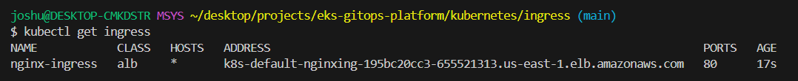
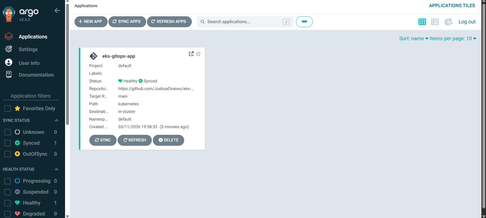
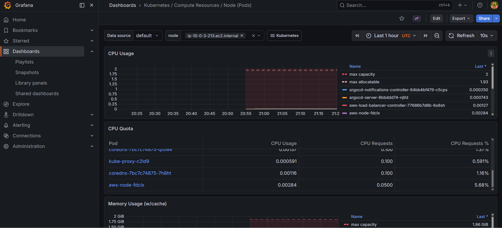
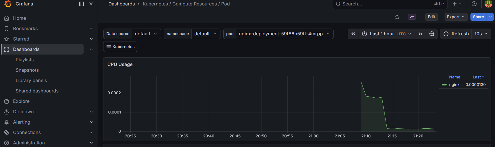

# Production Kubernetes GitOps Platform on AWS

This repository demonstrates how to design and operate a **production-style Kubernetes platform** using modern DevOps and platform engineering practices.

The platform provisions cloud infrastructure using Terraform, deploys applications using GitOps with ArgoCD, exposes services through an AWS Application Load Balancer, and provides full observability through Prometheus and Grafana.

---

## System Architecture

            Internet
                │
                ▼
    AWS Application Load Balancer
                │
                ▼
       Kubernetes Ingress
                │
                ▼
         Kubernetes Service
                │
                ▼
         Application Pods
                │
     ┌──────────┴──────────┐
     ▼                     ▼

Prometheus Metrics Kubernetes State
│
▼
Grafana
Observability Dashboard

---

## Platform Workflow

Developer Push
│
▼
GitHub
│
▼
ArgoCD
│
▼
Kubernetes Cluster (EKS)
│
▼
Application Deployment

ArgoCD continuously monitors the repository and synchronizes the Kubernetes cluster to match the **desired state stored in Git**.

---

## Infrastructure Provisioning

Terraform is used to provision the AWS infrastructure required to run the platform, including:

- VPC networking
- Public and private subnets
- Security groups
- Amazon EKS cluster
- Worker node groups

This ensures the infrastructure is **reproducible, version-controlled, and automated**.

---

## Kubernetes Ingress and Load Balancer

External traffic enters the platform through an **AWS Application Load Balancer (ALB)** managed by the AWS Load Balancer Controller.

The ALB routes incoming requests to services running inside the Kubernetes cluster.

---

## GitOps Deployment with ArgoCD

ArgoCD implements the **GitOps deployment model**, where the desired state of the cluster is defined in Git.

ArgoCD continuously monitors the repository and automatically synchronizes the cluster to match the Git configuration.

---

## Platform Observability with Prometheus and Grafana

Prometheus collects metrics from the Kubernetes cluster, including node usage, pod activity, and system health.

Grafana visualizes these metrics through dashboards that allow engineers to monitor:

- CPU utilization
- Memory consumption
- Pod activity
- Cluster performance

---

## Kubernetes Pod Monitoring

This dashboard shows pod-level resource consumption, allowing engineers to identify resource spikes and investigate workload behavior in real time.

---

## Simulated Deployment Failure

During testing, the nginx deployment was intentionally scaled beyond the cluster’s scheduling capacity.

This caused several pods to enter a **Pending state** due to pod-per-node limits in the worker node group.

The issue was diagnosed using Kubernetes scheduling events and resolved by scaling the EKS node group.

Detailed incident analysis is documented in:

docs/incidents/simulated-deployment-failure.md

---

## Technology Stack

Terraform  
AWS EKS  
Kubernetes  
Docker  
ArgoCD  
Prometheus  
Grafana  
AWS Application Load Balancer

---

## Key Capabilities Demonstrated

- Infrastructure as Code (Terraform)
- Kubernetes platform engineering
- GitOps-based deployment automation
- Cloud-native ingress with AWS ALB
- Production monitoring with Prometheus and Grafana
- Incident diagnosis and remediation
What your repo now communicates

When someone lands on your GitHub page they immediately see:

Architecture
↓
Infrastructure
↓
Deployment Automation
↓
Traffic Routing
↓
Observability
↓
Operational Failure Analysis